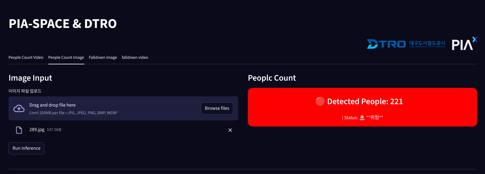
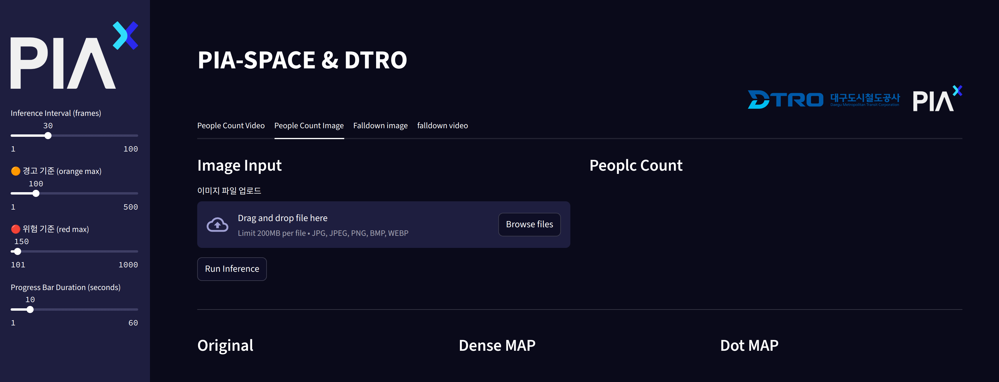
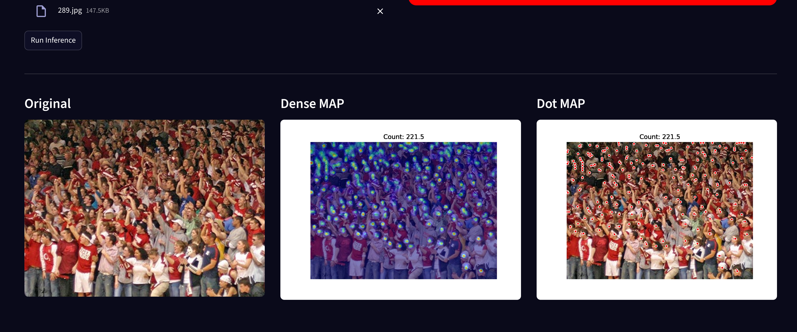

## 인터페이스 소개 (Crowd People Counting)

본 시스템은 이미지 또는 영상을 업로드하면 군중 수를 추론하여 시각적으로 결과를 제공합니다. 아래는 **People Count Image** 탭에서 이미지 파일을 업로드했을 때의 예시 화면입니다.

### 📌 업로드 및 추론 결과 예시

- 좌측: 이미지 업로드 영역 (`JPG`, `PNG`, `BMP`, `WEBP` 형식 지원, 최대 200MB)
- 우측: 탐지된 인원 수와 위험도 상태 표시  
  → 예시: `Detected People: 221`, **위험 상태**로 표시됨

### ⚙️ 인원 수 위험 기준 설정 기능

본 시스템에서는 인원 수에 따른 **혼잡도 경고 및 위험 알림**을 시각적으로 제공합니다.

* 감지된 인원 수는 우측에 `Detected People: ###` 형식으로 표시됩니다.
* 혼잡도 상태는 **안전 / 경고 / 위험** 세 가지 수준으로 나뉘며, 색상으로 구분됩니다:

| 상태    | 인원 수 기준            | 표시 색상        |
| ----- | ------------------ | ------------ |
| ✅ 안전  | `50명 미만`           | **파란색 / 없음** |
| ⚠️ 경고 | `50명 이상 ~ 100명 이하` | **주황색**      |
| 🚨 위험 | `100명 초과`          | **빨간색**      |

---

### 🎛️ 사용자 지정 가능: 위험 기준 설정

기본값은 위 기준으로 설정되어 있지만, **왼쪽 사이드바를 통해 직접 조정**할 수 있습니다.

* `경고 기준 (orange max)` – 기본값: `100`
* `위험 기준 (red max)` – 기본값: `150`
* 그 외 인퍼런스 주기나 프로그레스바 지속 시간 등도 조정 가능

아래 이미지를 참고하세요:

---

> ⚠️ 설정값은 실시간으로 반영되며, 인퍼런스 수행 시 해당 기준에 따라 위험도 색상이 동적으로 바뀝니다.

---

### 🔍 결과 시각화 (Original / Dense MAP / Dot MAP)

업로드 후에는 다음과 같은 3가지 형태로 시각화된 결과가 출력됩니다.

- **Original**: 업로드한 원본 이미지  
- **Dense MAP**: 밀도 기반 히트맵 시각화  
- **Dot MAP**: 각 인원 탐지 지점을 점으로 표시

