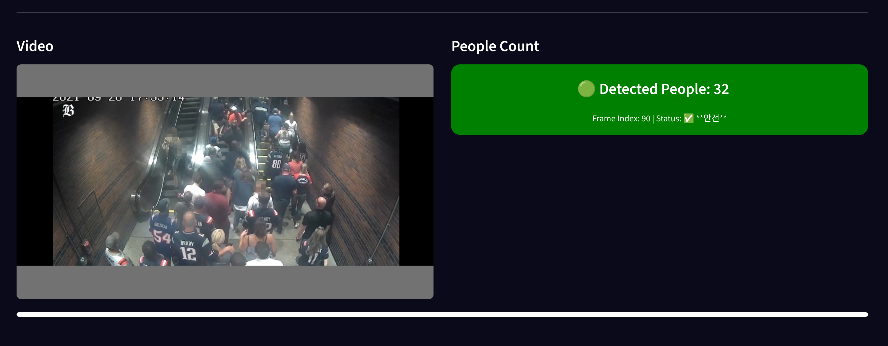

## 🎥 인터페이스 소개 (Video 기반 군중 수 카운팅)

`People Count Video` 탭에서는 영상 파일을 업로드하여 군중 수를 **프레임 단위로 자동 추론**할 수 있습니다. 주요 기능은 다음과 같습니다:

* 실시간 비디오 영상 표시
* 1초 단위로 인원 수 탐지 결과 출력
* 혼잡도에 따른 상태 색상 표시 (안전 / 경고 / 위험)

---

### 📥 영상 업로드 화면

사용자는 `MP4`, `AVI`, `MOV`, `WEBM`, `MPEG4` 형식의 동영상을 드래그 앤 드롭으로 업로드할 수 있습니다. (최대 200MB)

---

### 🔄 처리 대기 화면

`Run Inference` 버튼을 클릭하면 영상이 분석되며, 아래처럼 \*\*진행 바(progress bar)\*\*를 통해 처리 상태를 확인할 수 있습니다.

---

### ✅ 결과 화면

분석이 완료되면 다음과 같은 결과가 출력됩니다:

* 좌측: **실시간 비디오 영상**
* 우측: 1초 간격으로 추론된 **인원 수 및 상태 (안전 / 경고 / 위험)**

아래 예시는 인원 수 `32명`으로, **안전** 상태를 나타냅니다.

* `Detected People: 32`
* `Status: ✅ 안전`
* `Frame Index: 90` 등으로 프레임 기준 정보 제공

---

> ⚠️ 혼잡도 기준은 사용자 설정(sidebar)을 따릅니다. 기준값 설정에 대한 자세한 내용은 위 섹션의 `⚙️ 위험 기준 설정 기능`을 참고하세요.

---
