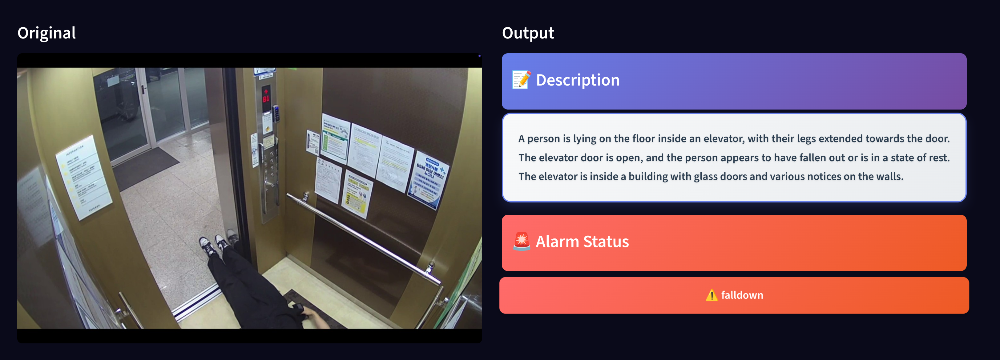

## 🧍‍♂️ Falldown 감지 (이미지 기반)

`Falldown image` 탭은 정지 이미지 기반으로 **낙상 여부를 자동 감지**하고, 해당 상황에 대해 설명(description) 및 경보 상태를 출력하는 기능입니다.

---

### 📤 이미지 업로드 화면

사용자는 낙상 여부를 판별하고자 하는 이미지를 업로드합니다.
지원 포맷: `JPG`, `PNG`, `BMP`, `WEBP` (최대 200MB)

---

### ✅ 결과 출력 화면

이미지를 업로드하고 `Inference` 버튼을 클릭하면 아래와 같은 결과가 표시됩니다.

* **좌측**: 원본 이미지 표시
* **우측**: 추론 결과

  * 📘 **Description**: 이미지 내용을 요약한 설명 문장 (영어)
  * 🚨 **Alarm Status**: 낙상 감지 여부 (`fall down`, `normal` 등)

---

### 🧠 설명 예시

예시 설명 문구:

> A person is lying on the floor inside an elevator, with their legs extended towards the door. The elevator door is open, and the person appears to have fallen out or is in a state of rest.

* 위와 같은 **자연어 요약**을 통해 상황 인지에 도움을 줍니다.
* 상태가 `falldown`인 경우, 시스템에서 경고로 분류되어 적절한 조치를 취할 수 있도록 설계되어 있습니다.
