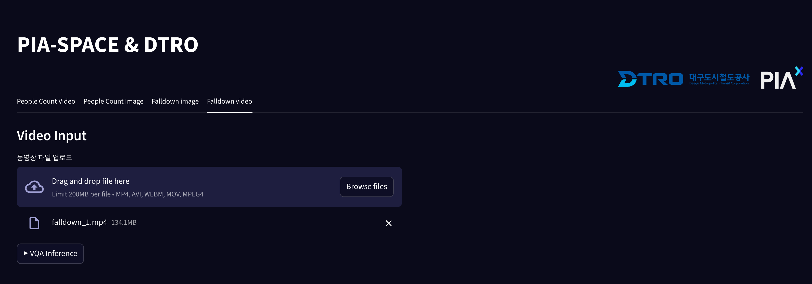
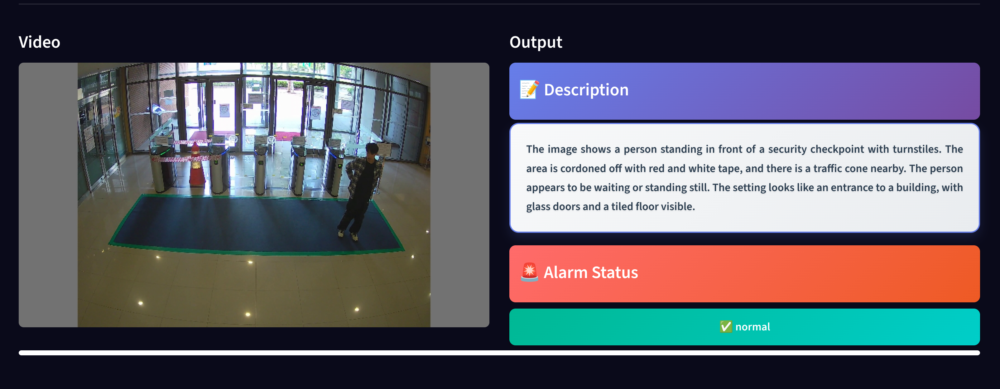

## 🧍‍♂️ Falldown 감지 (영상 기반)

`falldown video` 탭은 **영상을 업로드하면 프레임 간격 단위로 낙상 여부를 실시간 추론**하는 기능입니다.
사용자는 상황 녹화 영상을 업로드하면, 시스템이 특정 간격(기본 1초)마다 낙상 유무를 판단해 화면에 표시합니다.

---

### 📥 영상 업로드 화면

* 지원 포맷: `MP4`, `AVI`, `MOV`, `WEBM`, `MPEG4`
* 최대 용량: 200MB
* `Run Inference` 버튼을 클릭하면 추론이 시작됩니다.

---

### 🔁 실시간 추론 결과 화면

* **좌측**: 실시간 재생되는 영상 프레임
* **우측**: 선택된 프레임에서 추론된 낙상 여부 정보 출력

  * 📘 **Description**: 현재 프레임에 대한 시각 설명
  * 🚨 **Alarm Status**: 낙상 여부 판단 (`falldown`, `normal` 등)

---

### ⚙️ 설정 정보

* 기본 추론 간격은 **1초**이며, 설정값을 통해 간격 조정 가능
* 모든 프레임을 분석하지 않고, 일정 주기로 효율적으로 판단

---

### 예시 설명

> A person is lying on the floor inside an elevator, with their legs extended towards the door.
> The elevator door is open, and the person appears to have fallen out or is in a state of rest.

* 이와 같이, 낙상 여부뿐만 아니라 **상황에 대한 자연어 설명도 함께 제공**되어 모니터링 효율이 향상됩니다.
